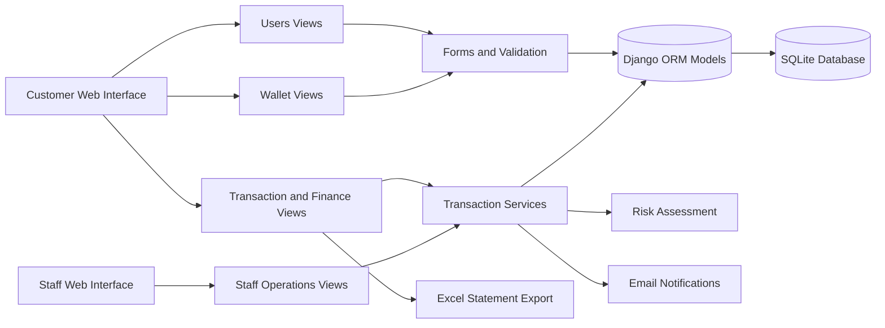
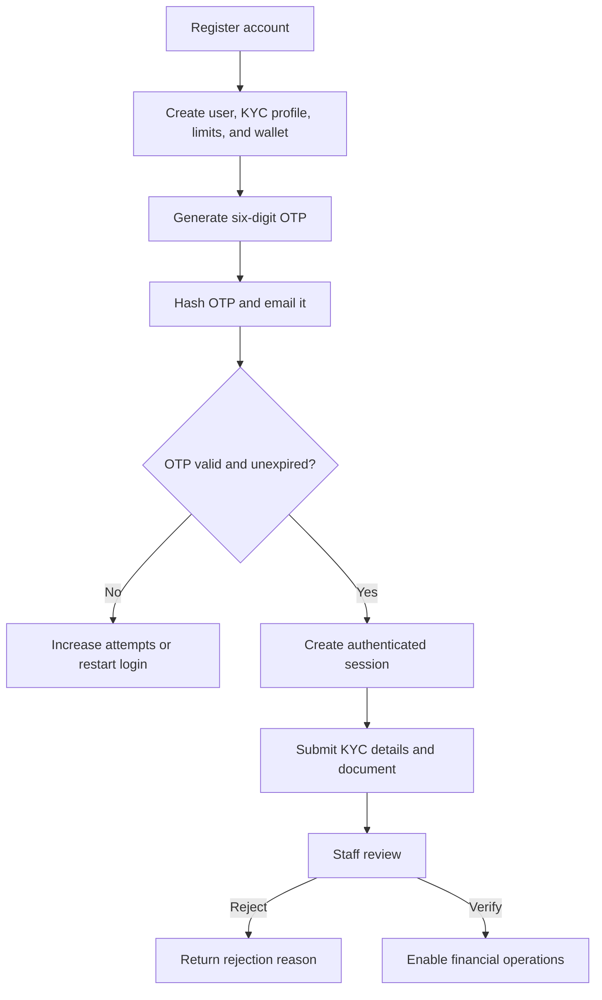
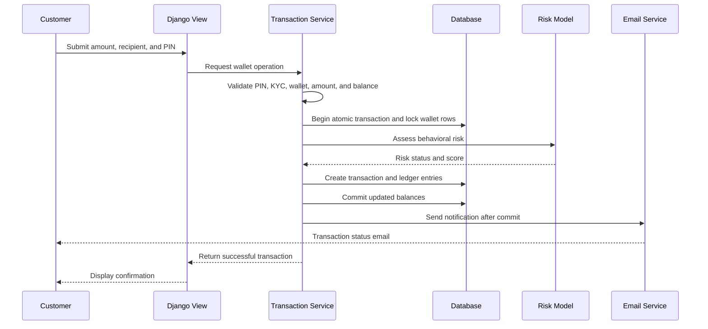
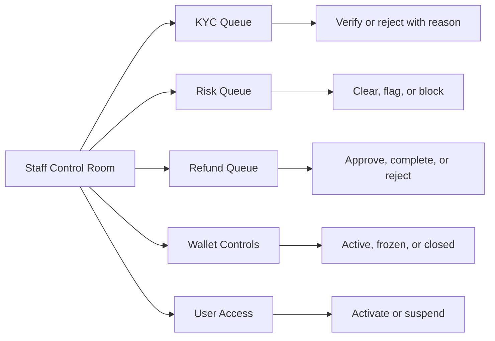

# Luma E-Wallet Management System
## Academic Project Documentation

> **Project type:** Web-based digital wallet and financial operations platform  
> **Application name:** Luma Wallet  
> **Currency:** Nepalese Rupee (NPR)  
> **Technology:** Django 6.1.1, Python, SQLite, HTML, CSS, JavaScript, pandas, CatBoost, openpyxl

## 3. Introduction

### Background of the project

The rapid adoption of digital financial services has increased the need for secure, accessible, and auditable electronic wallet systems. A digital wallet allows users to store value, add funds, withdraw money, transfer money to other users, and review their financial activity through a web interface. However, a useful wallet system must address more than balance management. It must also support identity verification, transaction authorization, fraud monitoring, operational review, customer support, and financial planning.

Luma Wallet was developed as a web-based e-wallet management system that combines customer-facing wallet services with an internal operations workspace. The system models a complete transaction lifecycle: a customer registers, verifies login through a one-time password, submits KYC information, configures a transaction PIN, performs wallet operations, and receives transaction notifications. Staff members can then review KYC applications, inspect risk-flagged transactions, manage wallets and user access, and process refund requests.

### Problem statement

Many basic wallet demonstrations focus only on adding and subtracting a balance. Such systems do not adequately represent the controls required in a financial application. They may lack identity verification, protection against repeated unauthorized attempts, a permanent ledger, fraud review, refund handling, or administrative accountability. This creates risks of unauthorized transactions, inconsistent balances, weak auditability, and poor operational visibility.

The project therefore addresses the problem of designing and implementing a wallet platform that provides convenient financial operations while incorporating layered authentication, KYC-based access control, transaction authorization, atomic balance updates, risk assessment, and staff oversight.

### Purpose of the project

The purpose of the project is to implement and demonstrate a secure, modular, and user-oriented e-wallet platform. The project also provides a practical study of how web application architecture, relational data modelling, financial transaction logic, security controls, and operational workflows can be integrated into one system.

## 4. Objectives

### Main objectives and goals of the project

The main objectives are to:

- Develop a web-based wallet in which each registered customer receives an individual wallet and wallet identifier.
- Provide secure registration and login using email-based OTP verification.
- Implement KYC submission and staff-controlled verification before financial operations are permitted.
- Support top-ups, withdrawals, wallet-to-wallet transfers, and refund completion.
- Protect financial actions through a hashed transaction PIN and failed-attempt lockout.
- Maintain auditable transaction and ledger records, including balance-before and balance-after values.
- Introduce behavioral transaction scoring to identify unusual activity for staff review.
- Provide a staff control room for KYC, risk, refund, wallet, and user-access operations.
- Support budgeting, expense categories, savings goals, financial charts, transaction filtering, and Excel statement export.
- Demonstrate a maintainable Django application organized into separate user, wallet, transaction, and staff-operation modules.

## 5. Methodology

The project followed an iterative software development methodology. Requirements were translated into user stories and operational workflows, followed by database modelling, service-layer implementation, template development, and local verification of the main use cases.

### Methods and procedures

1. **Requirement analysis:** The system was divided into customer, wallet, transaction, finance, and staff-operation requirements.
2. **Domain modelling:** Core entities and relationships were identified, including users, wallets, KYC profiles, transactions, ledger entries, budgets, savings goals, and refunds.
3. **Incremental implementation:** Features were implemented by Django application area: `users`, `wallets`, `transactions`, and `staff_operations`.
4. **Security-oriented validation:** Authentication, KYC status, wallet status, transaction PIN, balance sufficiency, and authorization checks were placed in the request and service layers.
5. **Transaction integrity:** Database transactions and row locking were used to prevent partial balance updates during wallet operations.
6. **Operational evaluation:** The staff dashboard was designed around actionable queues for pending KYC, flagged transactions, and refund requests.

### Tools and technologies

- **Python and Django 6.1.1:** Backend framework, routing, forms, authentication, ORM, sessions, CSRF protection, and templating.
- **SQLite:** Relational database used for local development and demonstration.
- **HTML templates and CSS:** Server-rendered customer and staff interfaces, with shared base templates.
- **pandas and CatBoost:** Feature preparation and behavioral risk scoring using the optional `behavioral_model_v2.pkl` model.
- **openpyxl:** Generation of downloadable Excel account statements.
- **SMTP and Django email utilities:** Delivery of login OTPs and transaction notifications.
- **Django migrations:** Version-controlled database schema evolution.
- **Environment variables:** Email configuration is loaded from `.env` through `python-dotenv`.

## 6. Project Implementation

### System architecture

The application uses a modular Django architecture. URL configurations direct requests to views, forms validate submitted data, models represent persistent data, and transaction services contain the central financial rules. The service layer is particularly important because top-up, withdrawal, transfer, and refund operations share security and integrity requirements.



**Figure 1.** High-level architecture of the Luma Wallet system. The diagram shows the separation between user interfaces, validation, service-layer business rules, persistent models, and supporting services.

### User registration, OTP authentication, and KYC

During registration, the system creates a user account and automatically provisions a KYC profile, a transfer-limit profile, and a wallet through a post-save signal. A six-digit OTP is generated using Python's secure `secrets` module. Only a password hash of the OTP is stored, and the code expires after five minutes. Five unsuccessful OTP attempts are permitted before the login request must be restarted.

After login, a customer submits full name, phone number, identification number, and an identity document. The KYC profile has `PENDING`, `VERIFIED`, and `REJECTED` states. A staff member records the verification decision, reviewer identity, timestamp, and rejection reason. Financial operations require a verified KYC status.



**Figure 2.** Authentication and KYC verification workflow. The workflow separates identity authentication from staff-controlled identity approval.

### Wallet and transaction implementation

Each customer has one wallet with a UUID-based wallet identifier, a decimal balance, a currency code, and an operational status. The current implementation uses NPR. The supported transaction types are top-up, withdrawal, transfer, and refund, with statuses including pending, successful, failed, and rejected.

The transaction service validates positive amounts, active wallet status, verified KYC status, PIN correctness, and sufficient balance. The service uses `select_for_update()` and `transaction.atomic()` so that the wallet balance and its ledger entries are updated as one database operation. For transfers, both the sender and receiver wallets are locked and two ledger entries are created: a debit for the sender and a credit for the receiver. Each ledger entry stores the balance before and after the operation, providing an audit trail.

A transaction PIN is stored as a hash rather than plaintext. Incorrect PIN attempts are counted; after five failed attempts, the account is suspended. Successful verification resets the failed-attempt counter. This provides a second authorization factor for financial actions after login.



**Figure 3.** Transaction processing sequence for a wallet operation. Atomic persistence and post-commit notification reduce the possibility of inconsistent balances or misleading messages.

### Fraud and risk assessment

The fraud module constructs behavioral features from transaction history. These include the logarithm of the transaction amount, a robust deviation from historical amounts, the smoothed average amount received by the destination wallet, and the difference between the current amount and the destination average. When the trained model is available, it returns a probability score. Transactions at or above the configured threshold of `0.5` are marked `FLAGGED`; lower-risk transactions are marked `CLEAR`. If the model is unavailable or cannot score the transaction, the system records `NOT_REVIEWED` and a reason rather than silently treating the transaction as safe.

### Staff operations and refund processing

The staff control room provides a consolidated view of customer count, wallet count, pending KYC checks, flagged transactions, pending refunds, and recent activity. Staff members can:

- verify or reject KYC profiles with review information;
- clear, flag, or block transactions and record a risk reason;
- activate, freeze, or close wallets;
- activate or suspend customer access, while preventing staff from suspending their own account;
- approve and complete or reject customer refund requests.

A completed refund creates a separate successful refund transaction and a corresponding credit ledger entry. The refund request retains the reviewer, status, and linked refund transaction, preserving traceability.



**Figure 4.** Staff operations and governance workflow. The queue-based design makes compliance and customer-support decisions visible and attributable.

### Financial planning and reporting

The finance dashboard groups successful outgoing transactions by month and category. Users can create budgets, monitor spent and remaining amounts, receive near-limit indicators at 80 percent, and mark a budget as over its limit. Users can also create savings goals with target amounts, target dates, notes, and progress percentages. Goal savings are implemented through a withdrawal and goal update within one atomic operation.

The activity history supports status and category filtering. The statement export generates an `.xlsx` file containing date, transaction ID, type, category, description, status, amount, currency, and credit/debit direction. These features extend the wallet from a transaction tool into a personal financial management system.

### Suggested screenshots and figures

The following screenshots should be captured from the running application and inserted below the corresponding figure captions:

- **Figure 5. Customer wallet dashboard:** balance, monthly income/spending chart, recent transactions, and quick actions.
- **Figure 6. OTP login screen:** six-digit email verification form.
- **Figure 7. KYC submission screen:** identity fields, document upload, and verification status.
- **Figure 8. Finance dashboard:** budgets, category totals, daily/monthly charts, and savings goals.
- **Figure 9. Staff control room:** pending KYC, flagged transactions, refunds, and wallet metrics.
- **Figure 10. Risk review queue:** transaction risk status, score/reason, and staff decision controls.

Screenshots should be captured with demonstration data only. Personal email addresses, identity documents, passwords, secret keys, and other sensitive values must be redacted before submission.

## 7. Results/Output

The completed system provides an end-to-end e-wallet workflow for customers and staff. The main outputs are:

- authenticated customer accounts with email OTP verification;
- automatically provisioned wallets, KYC records, and user limits;
- KYC-controlled wallet activity;
- PIN-authorized top-ups, withdrawals, transfers, and savings contributions;
- atomic financial records with auditable ledger entries;
- behavioral risk classifications and staff review decisions;
- customer transaction email notifications;
- refund requests with traceable approval and completion;
- budgets, expense categories, savings goals, charts, and Excel statements;
- a centralized staff operations workspace.

The implementation demonstrates that a web wallet can combine usability and governance in one application. A particularly significant observation is that financial correctness is handled in reusable service functions rather than being duplicated across individual views. This reduces the risk that one interface will enforce weaker rules than another.

## 8. Challenges and Limitations

### Problems encountered during the project

The project required coordination between authentication, KYC, wallet status, PIN verification, transaction integrity, risk scoring, notifications, and staff decisions. These concerns are interdependent: for example, a transfer cannot be permitted until both the customer identity and transaction PIN are valid, while a refund must produce a new auditable transaction without being processed twice.

Another challenge was accommodating optional fraud-model availability. The application therefore handles missing model files and scoring errors by recording an unavailable-review state and explanation rather than interrupting every transaction.

### Limitations of the project

- Top-ups and withdrawals are simulated; no banking, card, mobile-money, or payment-gateway integration is included.
- SQLite is suitable for demonstration and local development but is not the recommended database for high-concurrency production financial workloads.
- Fraud detection depends on the presence and quality of `behavioral_model_v2.pkl`; the current implementation is not a complete production fraud-management platform.
- The application currently supports a single wallet currency, NPR, and does not implement foreign-exchange conversion.
- Email delivery depends on correctly configured SMTP credentials and network access.
- The current development configuration uses `DEBUG=True` and contains a development secret key; production deployment requires secret management and hardened settings.
- No automated test suite, independent security audit, multi-factor hardware authentication, or deployment monitoring is included in the current project scope.
- The system is a prototype and does not replace regulated financial infrastructure or formal legal/compliance review.

## 9. Conclusion

Luma Wallet successfully implements a modular e-wallet management platform that goes beyond basic balance operations. It combines OTP-verified authentication, KYC governance, hashed transaction PINs, account suspension controls, atomic wallet transactions, auditable ledger entries, behavioral risk scoring, staff review queues, refunds, financial planning, notifications, and statement export.

The major achievement of the project is the integration of customer convenience with operational control. The project demonstrates learning in Django application architecture, relational modelling, secure form handling, database transactions, access control, email workflows, risk-feature engineering, and responsive interface design. It also shows that a financial application must be evaluated not only by whether a balance changes, but by whether the change is authorized, consistent, explainable, and reviewable.

## 10. Future Scope

Possible improvements include:

- integration with real payment gateways, bank APIs, mobile-money services, and webhook verification;
- migration to PostgreSQL with stronger concurrency testing and database backups;
- production security hardening, including environment-managed secrets, secure cookies, HTTPS enforcement, rate limiting, audit logs, and content-security policies;
- a dedicated automated test suite for models, services, authorization, race conditions, refunds, and fraud-review decisions;
- improved fraud detection through model versioning, training-data monitoring, explainable features, and analyst feedback loops;
- configurable transaction and withdrawal limits based on risk profile and regulatory requirements;
- multi-currency wallets and exchange-rate services;
- push notifications, SMS OTP fallback, and device/session management;
- pagination, advanced search, downloadable PDF statements, and scheduled reports;
- customer support tickets and a fuller dispute-resolution workflow;
- containerized deployment, observability, backups, and role-based staff permissions beyond the current staff flag.

## 11. References

1. Django Software Foundation. *Django Documentation*. https://docs.djangoproject.com/
2. Python Software Foundation. *Python Documentation: `secrets`, `hashlib`, and standard library reference*. https://docs.python.org/3/
3. Django Software Foundation. *Django Security Documentation*. https://docs.djangoproject.com/en/stable/topics/security/
4. CatBoost Developers. *CatBoost Documentation*. https://catboost.ai/docs/
5. pandas Development Team. *pandas Documentation*. https://pandas.pydata.org/docs/
6. OpenPyXL Documentation. *openpyxl Documentation*. https://openpyxl.readthedocs.io/
7. OWASP Foundation. *OWASP Application Security Verification Standard*. https://owasp.org/www-project-application-security-verification-standard/
8. Luma Wallet source code, including `apps/users`, `apps/wallets`, `apps/transactions`, `apps/staff_operations`, `config`, and `templates` modules. Local project repository, 2026.

## 12. Appendices

### Appendix A: Principal data entities

| Entity | Purpose |
|---|---|
| User | Authentication identity and account status |
| KYCProfile | Identity details, document, verification status, reviewer, and PIN hash |
| LimitProfile | Daily transfer and withdrawal limits |
| Wallet | UUID, balance, currency, and operational status |
| Transaction | Financial operation, status, risk state, and participants |
| LedgerEntry | Debit/credit movement with before-and-after balances |
| RefundRequest | Customer refund request and staff decision history |
| Budget | Monthly category spending limit |
| BudgetGoal | Savings target and progress |
| ExpenseCategory | Shared or user-specific spending classification |
| LoginOTP | Hashed, expiring login verification code |

### Appendix B: Principal project modules

```text
apps/users/              Registration, OTP login, KYC, profile, security
apps/wallets/            Wallet dashboard and wallet model
apps/transactions/       Financial services, models, forms, fraud, notifications
apps/staff_operations/   Staff dashboard and review queues
apps/core/               Shared timestamped model functionality
config/                  Django settings, URL configuration, ASGI, and WSGI
templates/               Customer and staff interfaces
static/css/app.css       Application presentation layer
```

### Appendix C: Demonstration checklist

- Create two customer accounts with email addresses configured in `.env`.
- Complete OTP login and set transaction PINs.
- Submit KYC details for both customers.
- Use a staff account to verify the KYC profiles.
- Perform a top-up, transfer, withdrawal, and refund request.
- Inspect the customer history, finance dashboard, statement export, and staff queues.
- Demonstrate an incorrect PIN and verify the warning/lockout behavior.
- Capture and redact the screenshots listed in Section 6 before including them in the final submission.
